<h1 align="center">Denoising Diffusion Probabilistic Models (DDPMs)</h1>

<p align="center">
  <em>Derivation, from-scratch PyTorch implementation, and experimental analysis of DDPMs on MNIST and CIFAR-10.</em>
</p>

<p align="center">
  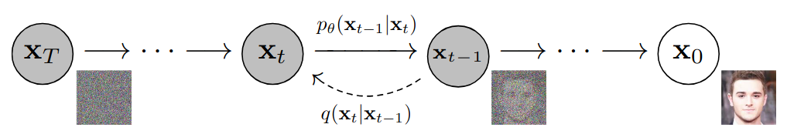
</p>

<p align="center">
  <sub><b>Figure from Ho, Jain &amp; Abbeel (2020), <i>Denoising Diffusion Probabilistic Models</i>, <a href="https://arxiv.org/abs/2006.11239">arXiv:2006.11239</a> (Fig. 2). Not our work; reproduced here for illustration.</b><br>
  The forward process <i>q</i> gradually destroys an image into noise. The reverse process <i>p<sub>θ</sub></i>, a learned neural network (a U-Net in our implementation), turns noise back into a coherent sample.</sub>
</p>

**Authors:** Hoang Dung Vu Minh and Christopher Won

**Quick links:** [Full report (PDF)](paper.pdf) · [Slides (PDF)](slides.pdf) · [Results](#results) · [Notebooks](#repository-contents) · [Running the code](#running-the-notebooks)

---

## Overview

Denoising Diffusion Probabilistic Models are a class of deep generative models: neural networks trained to synthesize new data that closely resembles a training distribution. Introduced by Sohl Dickstein et al. (2015) and popularized by Ho, Jain, and Abbeel (2020), DDPMs are known for stable training and strong sample quality, often matching or surpassing GANs without any adversarial objective.

The method has two phases:

1. **Forward diffusion process**: Gaussian noise is added to an image over many timesteps until the original signal is destroyed and only noise remains.
2. **Reverse process**: a neural network (a U-Net in this project) learns to iteratively remove that noise, so that starting from pure random noise, it can generate a new, coherent sample.

This repository derives the full DDPM training objective from first principles (the evidence lower bound and its closed form simplification), then implements and trains the forward and reverse processes from scratch, without relying on any prebuilt diffusion library.

## Some Results

Three CIFAR-10 architectures, same training budget, very different outcomes. Each grid shows samples generated from pure noise.

<table>
  <tr>
    <td align="center" width="33%">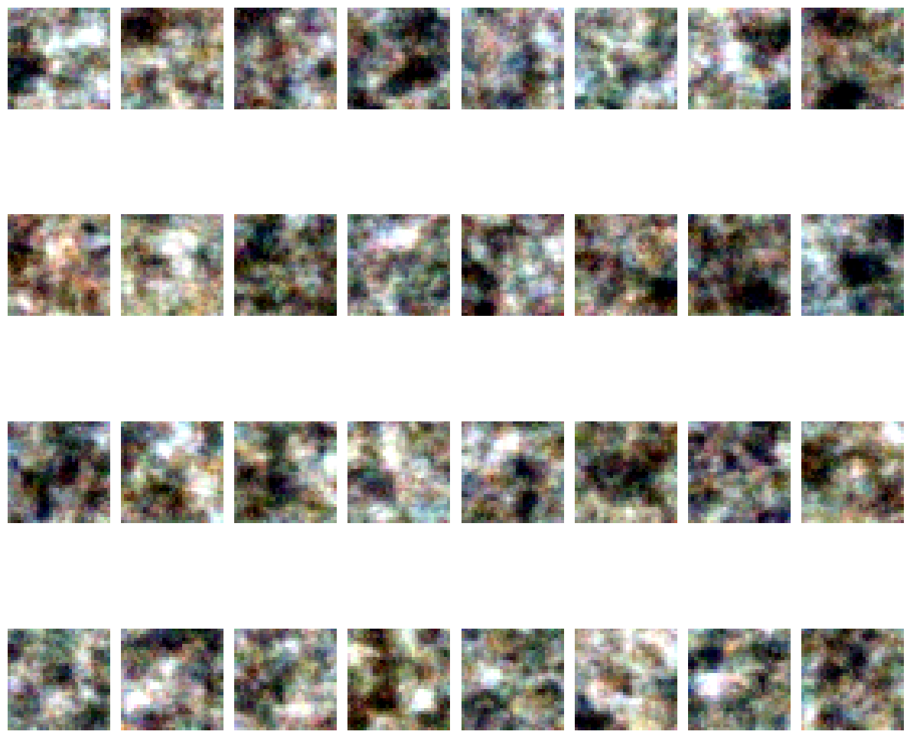</td>
    <td align="center" width="33%">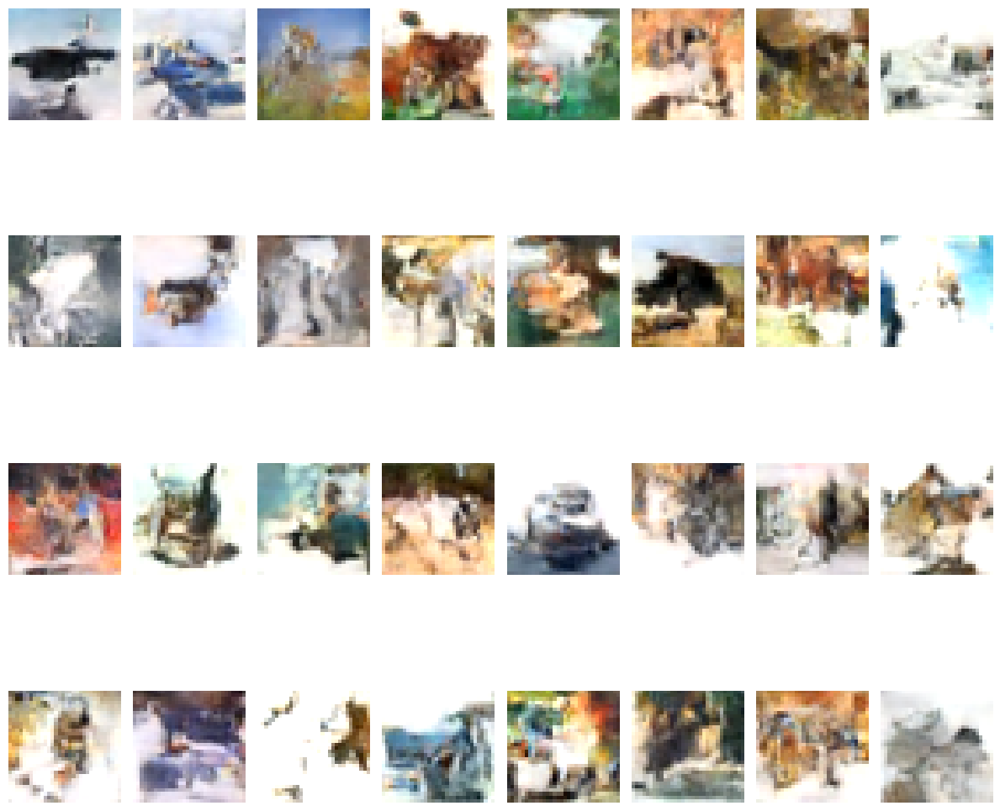</td>
    <td align="center" width="33%">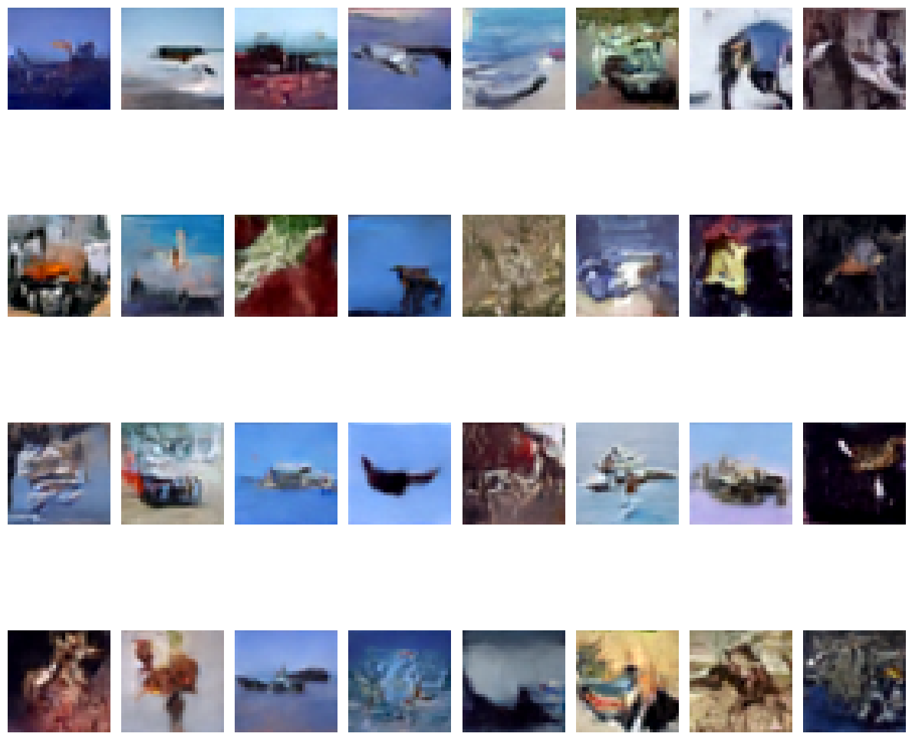</td>
  </tr>
  <tr>
    <td align="center"><b>Model 1</b><br><sub>T = 500 · MNIST architecture reused<br>Output is close to pure noise</sub></td>
    <td align="center"><b>Model 2</b><br><sub>T = 1000 · + GroupNorm, + attention<br>Clearer edges, brighter images</sub></td>
    <td align="center"><b>Model 3</b><br><sub>T = 1000 · further refinement<br>Coherent color and structure</sub></td>
  </tr>
</table>

> **Takeaway:** architectural appropriateness mattered more than raw depth. Going from grayscale to color needed the right mix of normalization, attention, and a longer diffusion chain, not just more capacity.

## Method Summary

The forward process turns an image into noise through a fixed Markov chain of Gaussian steps. Because this process is fixed rather than learned, it has a closed form expression at any timestep, which makes training efficient: a noisy version of an image at any point in the chain can be sampled directly, without simulating every intermediate step.

The reverse process is where learning happens. A U-Net is trained to predict the noise that was added at a given timestep, conditioned on the noisy image and the timestep itself. Training minimizes a simplified form of the evidence lower bound, derived in full in [`paper.pdf`](paper.pdf) (Sections 4.1 to 4.3), which reduces to a straightforward noise prediction loss.

Once trained, generating a new sample means starting from pure Gaussian noise and repeatedly applying the learned reverse step, gradually revealing a coherent image.

### The U-Net

The noise predictor is a U-Net: an encoder that compresses the image while extracting features, a bottleneck that also receives the timestep embedding, and a decoder that expands back to full resolution. Skip connections carry fine detail across.

<p align="center">
  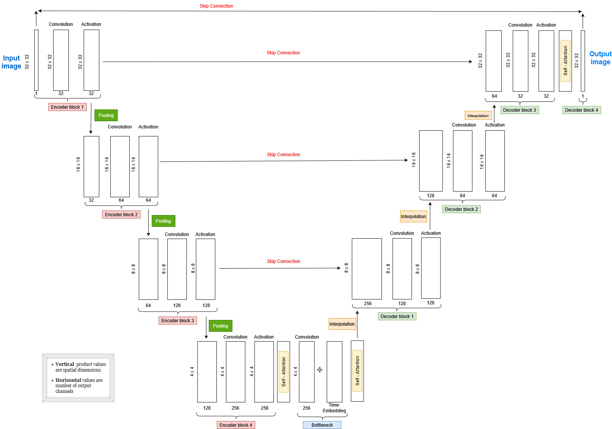
</p>

<p align="center">
  <sub>Improved U-Net (MNIST model 2): an extra encoder/decoder block, self attention, and transformer style time embeddings. The baseline U-Net is shown in <a href="images/fig15_unet_model1.png">images/fig15_unet_model1.png</a>.</sub>
</p>

## Results

### MNIST

Model 1, using a basic U-Net, struggled to capture the underlying pixel distribution and produced noticeably lower quality samples. Model 2, with its additional encoder/decoder block, self attention, and transformer style time embeddings, produced clearer and more diverse digits.

<table>
  <tr>
    <td align="center" width="50%">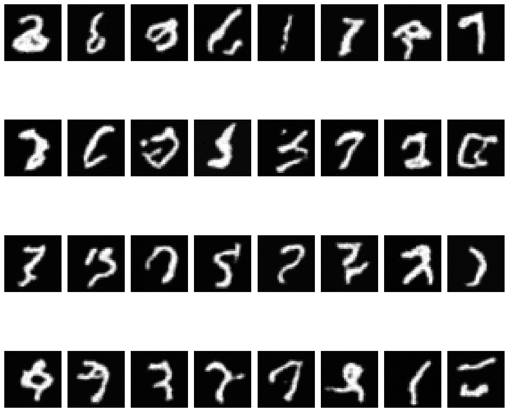</td>
    <td align="center" width="50%">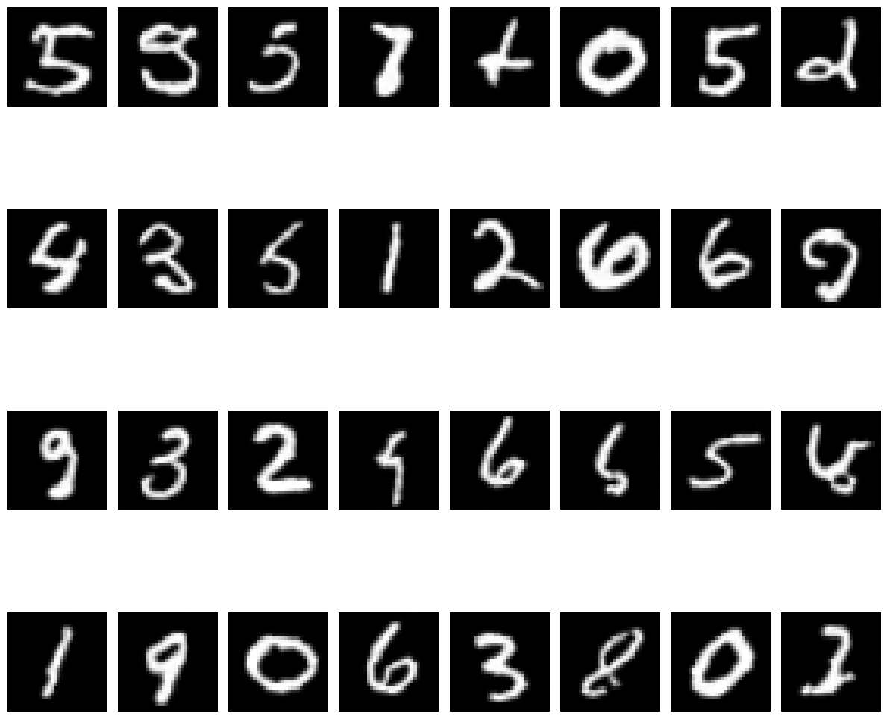</td>
  </tr>
  <tr>
    <td align="center"><b>Model 1</b> (basic U-Net)<br><sub>Distorted, often unrecognizable strokes</sub></td>
    <td align="center"><b>Model 2</b> (attention + time embeddings)<br><sub>Clean, recognizable digits</sub></td>
  </tr>
</table>

**Watching a digit emerge.** Visualizing the reverse process at selected timesteps (top row is the final sample, bottom row is pure noise) shows that recognizable digit structure appears by roughly the halfway point of the denoising chain.

<p align="center">
  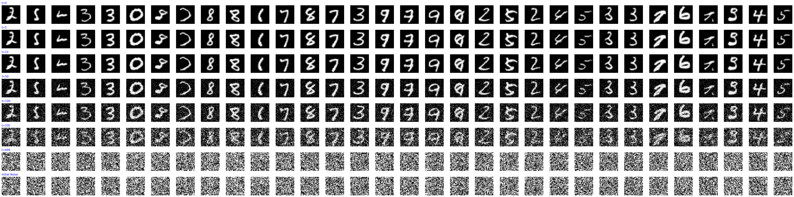
</p>

**Training dynamics.** Examining training and validation loss across epochs also revealed the value of early stopping to avoid overfitting. The validation loss tracks the training loss closely, with occasional spikes (for example near epoch 21) that early stopping guards against.

<p align="center">
  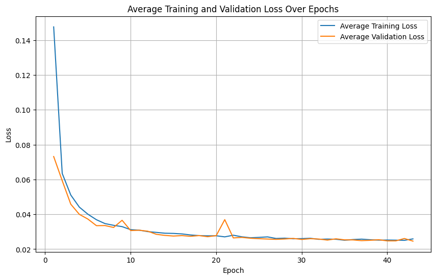
</p>

### CIFAR-10

The jump from grayscale to color images proved far harder. Model 1, reusing the MNIST model 2 architecture with only an RGB input change, produced samples that were close to pure noise. Model 2, with Group Normalization and extra self attention, showed clear improvement in edge definition and brightness. Model 3 achieved the strongest alignment with real CIFAR-10 images: individual samples remain somewhat abstract, but color, edge structure, and overall coherence improved markedly across the three iterations.

**Model 3 against real images.** In this grid, odd columns are real CIFAR-10 images and even columns are generated samples. Generated samples capture the characteristic color palettes (blue sky and sea, green and brown landscapes) and rough object silhouettes of the real data.

<p align="center">
  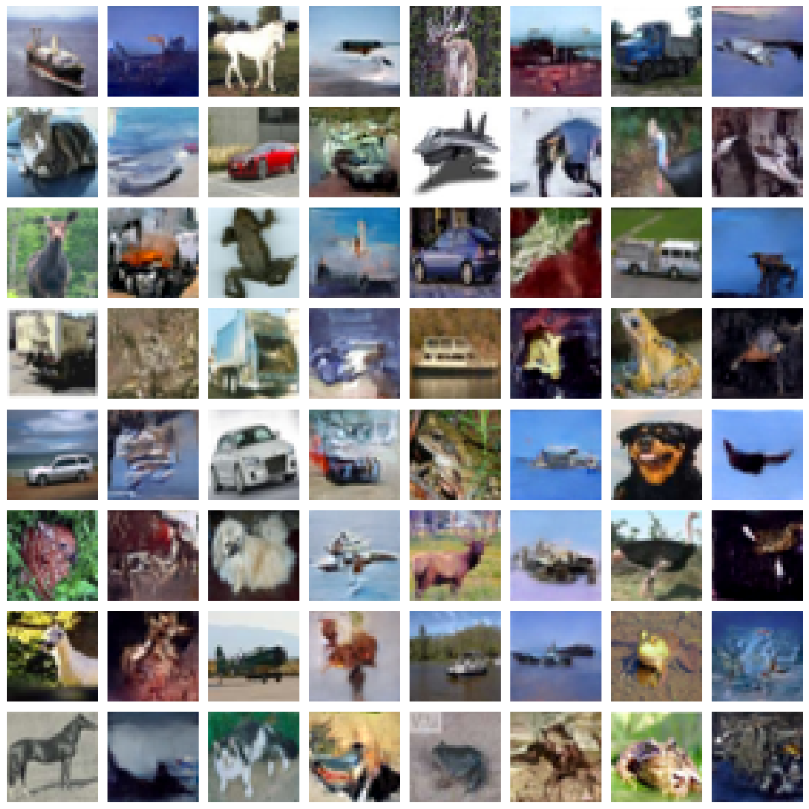
</p>

**From noise to image.** Progressive generation with CIFAR-10 model 3, from pure noise (bottom) to the final samples (top):

<p align="center">
  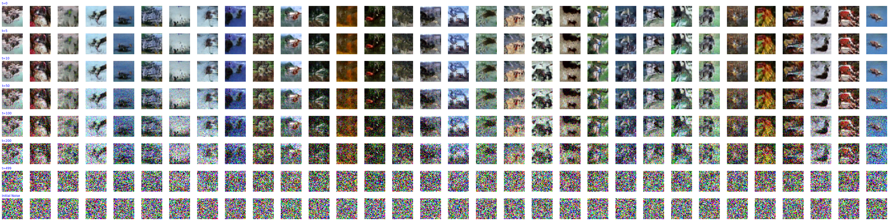
</p>

<details>
<summary><b>More comparisons against real data</b></summary>
<br>

<table>
  <tr>
    <td align="center" width="33%">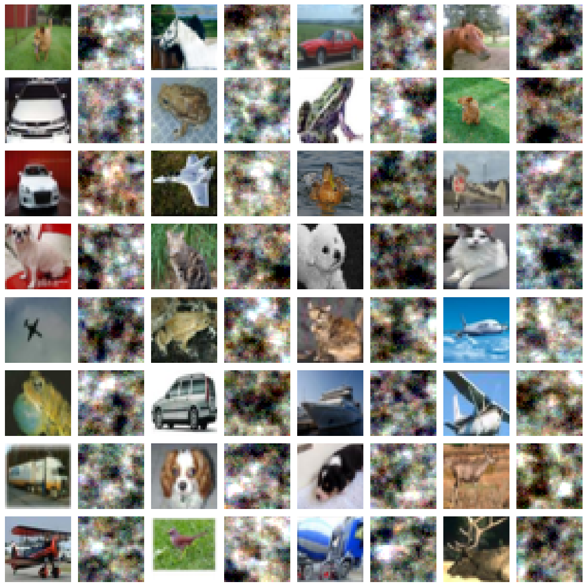</td>
    <td align="center" width="33%">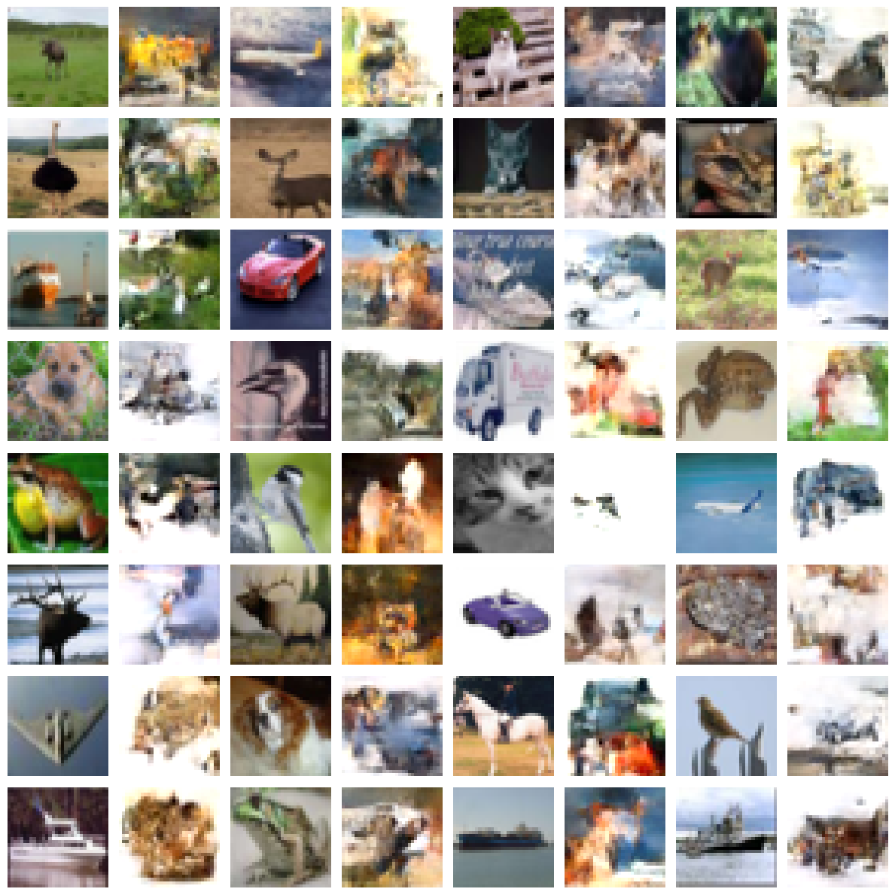</td>
    <td align="center" width="33%"></td>
  </tr>
  <tr>
    <td align="center"><sub>Model 1: generated columns are noise next to real images</sub></td>
    <td align="center"><sub>Model 2</sub></td>
    <td align="center"><sub>Model 3</sub></td>
  </tr>
</table>

<table>
  <tr>
    <td align="center" width="50%">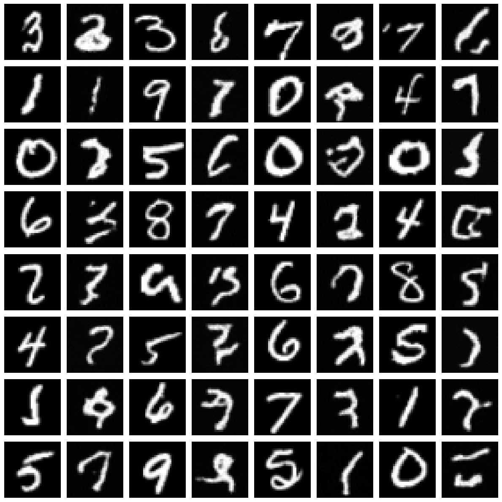</td>
    <td align="center" width="50%">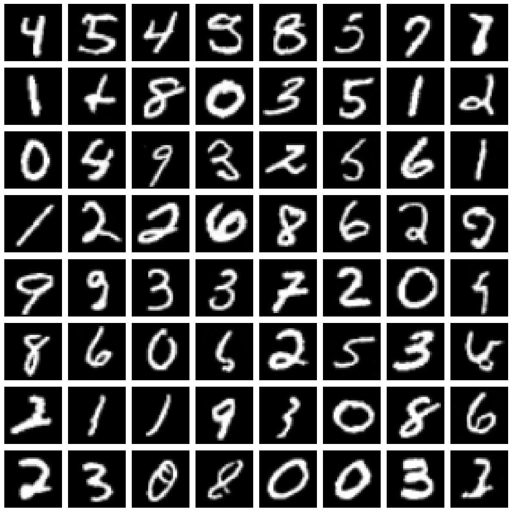</td>
  </tr>
  <tr>
    <td align="center"><sub>MNIST model 1 vs real samples</sub></td>
    <td align="center"><sub>MNIST model 2 vs real samples</sub></td>
  </tr>
</table>

</details>

### Overall conclusion

Architectural appropriateness mattered more than raw depth. Scaling from MNIST to CIFAR-10 required not just more capacity but the right combination of normalization, attention, and a longer diffusion chain (1000 rather than 500 timesteps) before the model could reliably generate coherent color images.

## Experiments and Configuration

| Model | Dataset | Timesteps | Epochs | Batch size | Learning rate | Architecture notes |
|---|---|---|---|---|---|---|
| Model 1 | MNIST | 500 | 50 | 128 | 1e-3 | Basic U-Net |
| Model 2 | MNIST | 500 | 50 | 128 | 1e-3 | Basic U-Net + self attention + transformer time embeddings + extra encoder/decoder block |
| Model 1 | CIFAR-10 | 500 | 60 | 128 | 1e-3 | MNIST model 2 architecture, adapted for RGB input |
| Model 2 | CIFAR-10 | 1000 | 60 | 128 | 1e-3 | Adds Group Normalization and additional self attention layers |
| Model 3 | CIFAR-10 | 1000 | 60 | 128 | 1e-3 | Further architectural refinement; strongest qualitative results |

All models were implemented directly in PyTorch (`torch`, `torch.nn`, `torch.nn.functional`), with `torchvision` for datasets and transforms, and `matplotlib`, `pandas`, and `seaborn` used for visualization and loss curve analysis.

## Repository Contents

| File | Description |
|---|---|
| [`paper.pdf`](paper.pdf) | Full written report: theoretical derivation of the DDPM objective, methodology, results, architectural discussion, and proofs |
| [`slides.pdf`](slides.pdf) | Presentation slides summarizing the project |
| [`MNIST_Diffusion_model_1_reproducible.ipynb`](MNIST_Diffusion_model_1_reproducible.ipynb) | Baseline U-Net trained on MNIST |
| [`MNIST_Diffusion_model_2_reproducible.ipynb`](MNIST_Diffusion_model_2_reproducible.ipynb) | Improved U-Net on MNIST, adds an extra encoder/decoder block, a self attention mechanism, and transformer style time embeddings |
| [`CIFAR_10_Diffusion_model_1_reproducible.ipynb`](CIFAR_10_Diffusion_model_1_reproducible.ipynb) | The MNIST model 2 architecture adapted to RGB input, applied directly to CIFAR-10 |
| [`CIFAR_10_Diffusion_model_2_reproducible.ipynb`](CIFAR_10_Diffusion_model_2_reproducible.ipynb) | CIFAR-10 model with Group Normalization added to each encoder/decoder block and additional self attention layers in the encoder path |
| [`CIFAR_10_Diffusion_model_3_reproducible.ipynb`](CIFAR_10_Diffusion_model_3_reproducible.ipynb) | The most refined CIFAR-10 model; also includes code to produce the progressive generation grid (noise to final sample) shown above |
| [`images/`](images) | Figures extracted from the paper and used in this README |

Each notebook is self contained and reproducible: it includes a Colab badge and runs end to end (data loading, training, and sample generation) without depending on the other notebooks.

## Running the Notebooks

Each notebook can be opened directly in Google Colab through the badge at the top of the file, or run locally with the following dependencies:

```
torch
torchvision
matplotlib
pandas
seaborn
```

No additional setup or external data download is required. Each notebook fetches its dataset (MNIST or CIFAR-10) directly through `torchvision.datasets` on first run.

## References

- Sohl Dickstein, J., Weiss, E. A., Maheswaranathan, N., & Ganguli, S. (2015). *Deep Unsupervised Learning using Nonequilibrium Thermodynamics*. arXiv:1503.03585
- Ho, J., Jain, A., & Abbeel, P. (2020). *Denoising Diffusion Probabilistic Models*. arXiv:2006.11239
- Vaswani, A., et al. (2017). *Attention is all you need*. NeurIPS 30, 5998 to 6008
- Kapila, N., & collaborators. (2024). *CNNtention: Can CNNs do better with Attention?* arXiv:2412.11657
- Wang, Y., Chen, Y., Liu, X., & Zhao, L. (2024). *Development of skip connection in deep neural networks for computer vision and medical image analysis: A survey*. arXiv:2405.01725

Full derivations, proofs, and additional figures are available in [`paper.pdf`](paper.pdf).
